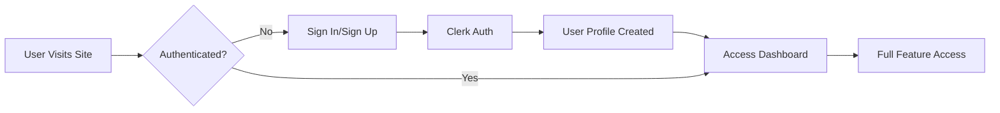

<div align="center">

# 🌈 MoodMate - AI-Powered Wellness Dashboard

[](https://reactjs.org/)
[](https://vitejs.dev/)
[](https://tailwindcss.com/)
[](https://www.typescriptlang.org/)
[](https://clerk.com/)

**An all-in-one wellness, entertainment, and productivity web application that helps users stay positive, organized, and relaxed throughout the day.**

[Features](#-features) • [Tech Stack](#-tech-stack) • [Installation](#-installation--setup) • [Project Structure](#-project-structure) • [Demo](#-demo)

---

</div>

## 🎯 Overview

**MoodMate** is a modern, AI-powered dashboard that combines wellness, entertainment, and productivity tools into a single, beautiful interface. It features an intelligent mood-based assistant that understands your emotional state and suggests relevant activities - from calming yoga sessions when you're stressed, to entertaining jokes when you're feeling down.

### 🌟 What Makes MoodMate Special?

- **🤖 AI Mood Recognition** - Smart assistant that analyzes your input and suggests personalized activities
- **🎨 Modern UI/UX** - Beautiful, glassmorphic design with smooth animations using Framer Motion
- **🌙 Theme Support** - Seamless dark/light mode switching with persistent storage
- **🔐 Enterprise-Grade Auth** - Secure authentication powered by Clerk
- **⚡ Lightning Fast** - Built with Vite for instant hot module replacement
- **📱 Fully Responsive** - Works flawlessly on desktop, tablet, and mobile devices

---

## ✨ Features

### 🧘 Wellness & Relaxation
- **Yoga Sessions** - Guided yoga videos and wellness exercises
- **Ambient Music Player** - Calming music to help you focus and relax
- **Daily Meditation** - Mindfulness exercises for mental clarity

### 😂 Entertainment Zone
- **Random Jokes** - Instant mood lifters with categorized humor
- **Meme Generator** - Browse and share trending memes
- **Motivational Quotes** - Daily inspiration from thought leaders

### 📰 Information Hub
- **Live News Feed** - Real-time headlines from trusted sources
- **Weather Updates** - Current weather conditions and forecasts
- **Food Recipes** - Discover and save delicious recipes

### 📝 Productivity Suite
- **Smart Todo Manager** - Track tasks with priority levels and due dates
- **Expense Tracker** - Monitor your spending with visual analytics
- **Timer & Alarm** - Pomodoro timer and customizable alarms
- **Daily Diary** - Personal journaling with markdown support

### 🤖 AI Assistant Features
The intelligent assistant can:
- Detect your mood from conversational input
- Suggest relevant features based on emotional state
- Auto-navigate to appropriate sections
- Provide contextual recommendations

**Example Commands:**
```
"I feel stressed" → Suggests: Yoga, Music, Meditation
"I'm bored" → Suggests: Jokes, Memes, News
"Open weather" → Auto-navigates to Weather page
"Show me quotes" → Opens Quotes section
```

---

## 🛠️ Tech Stack

### **Frontend Architecture**

| Technology | Version | Purpose |
|-----------|---------|---------|
| **React** | 19.2.0 | UI component library with latest concurrent features |
| **Vite** | 7.2.4 | Build tool for lightning-fast HMR and optimized production builds |
| **Tailwind CSS** | 4.1.18 | Utility-first CSS framework for rapid UI development |
| **Framer Motion** | 12.26.2 | Production-ready animation library for smooth transitions |
| **React Router** | 7.12.0 | Client-side routing with nested routes and lazy loading |
| **Clerk** | 5.59.3 | Complete authentication solution with social logins |
| **Lucide React** | 0.562.0 | Beautiful, consistent icon set |
| **Bun** | Latest | Ultra-fast JavaScript runtime and package manager |

### **UI Components & Design**

- **Aceternity UI** - Premium, customizable React components
- **Particles** (@tsparticles) - Interactive background animations
- **Class Variance Authority** - Type-safe component variants
- **Tailwind Merge** - Intelligent class merging for dynamic styles
- **Mini SVG Data URI** - Efficient SVG background patterns

### **Backend (Future-Ready)**

Currently, MoodMate is frontend-focused, but the backend structure is prepared for:
- Node.js/Express API server
- Database integration (MongoDB/PostgreSQL)
- RESTful API endpoints
- User data persistence

---

## 📂 Project Structure

```
MoodMate/
│
├── 📁 frontend/                    # Frontend application
│   ├── 📁 src/
│   │   ├── 📁 pages/              # Route-based page components
│   │   │   ├── Home.jsx           # Main dashboard with AI assistant
│   │   │   ├── About.jsx          # Project information
│   │   │   ├── Yoga.jsx           # Yoga videos and guides
│   │   │   ├── Music.jsx          # Music player interface
│   │   │   ├── Jokes.jsx          # Joke cards and random jokes
│   │   │   ├── Memes.jsx          # Meme browser
│   │   │   ├── Quotes.jsx         # Motivational quotes
│   │   │   ├── News.jsx           # News feed aggregator
│   │   │   ├── Weather.jsx        # Weather dashboard
│   │   │   ├── Food.jsx           # Recipe finder
│   │   │   ├── Todo.jsx           # Task management
│   │   │   ├── Expense.jsx        # Expense tracker
│   │   │   ├── TImerAlarm.jsx     # Timer and alarm
│   │   │   ├── Dailydiary.jsx     # Personal diary
│   │   │   ├── Profile.jsx        # User profile (Clerk)
│   │   │   ├── Signin.jsx         # Authentication page
│   │   │   └── Signup.jsx         # Registration page
│   │   │
│   │   ├── 📁 components/         # Reusable components
│   │   │   ├── Navbar.jsx         # Navigation with dark mode toggle
│   │   │   ├── Footer.jsx         # Footer with social links
│   │   │   ├── FloatingAI.jsx     # AI assistant chatbot
│   │   │   ├── CategoryTabs.jsx   # Feature category navigation
│   │   │   ├── HeroText.jsx       # Animated hero section
│   │   │   ├── NoiseButton.jsx    # Interactive button component
│   │   │   ├── JokeCard.jsx       # Individual joke display
│   │   │   ├── VideoGrid.jsx      # Video thumbnail grid
│   │   │   └── 📁 ui/             # Aceternity UI components
│   │   │       ├── animated-tooltip.jsx
│   │   │       ├── cover.jsx
│   │   │       ├── background-gradient.jsx
│   │   │       └── ... (more UI components)
│   │   │
│   │   ├── 📁 routes/             # Route configuration
│   │   │   └── AppRoutes.jsx      # Protected & public routes
│   │   │
│   │   ├── 📁 lib/                # Utilities and helpers
│   │   │   └── utils.js           # Tailwind class merger
│   │   │
│   │   ├── App.jsx                # Root component with routing
│   │   ├── main.jsx               # Application entry point
│   │   └── index.css              # Global styles and Tailwind
│   │
│   ├── .env                       # Environment variables
│   ├── package.json               # Dependencies and scripts
│   ├── vite.config.js             # Vite configuration
│   ├── tailwind.config.js         # Tailwind customization
│   └── tsconfig.json              # TypeScript configuration
│
├── 📁 backend/                    # Backend (future expansion)
│   ├── 📁 src/
│   │   └── index.ts               # Server entry point
│   ├── package.json
│   └── tsconfig.json
│
├── .gitignore                     # Git ignore rules
├── README.md                      # This file
└── LICENSE                        # Project license

```

---

## 🚀 Installation & Setup

### Prerequisites

Before you begin, ensure you have the following installed:
- **Bun** (v1.0+) - [Install Bun](https://bun.sh/)
- **Node.js** (v18+) - Alternative package manager
- **Git** - Version control
- **Clerk Account** - For authentication ([Sign up free](https://clerk.com/))

### Step-by-Step Installation

#### 1️⃣ Clone the Repository

```bash
git clone https://github.com/hitaishi18-coder/MoodMate.git
cd MoodMate
```

#### 2️⃣ Install Frontend Dependencies

```bash
cd frontend
bun install
```

*Alternative with npm:*
```bash
npm install
```

#### 3️⃣ Configure Environment Variables

Create a `.env` file in the `frontend` directory:

```bash
# Create .env file
touch .env
```

Add your Clerk API keys:

```env
# Clerk Authentication Keys
VITE_CLERK_PUBLISHABLE_KEY=pk_test_your_publishable_key_here

# Optional: Add your Clerk Frontend API (if using)
# VITE_CLERK_FRONTEND_API=your_frontend_api_here
```

**Where to get Clerk keys:**
1. Sign up at [clerk.com](https://clerk.com/)
2. Create a new application
3. Copy the publishable key from the dashboard
4. Paste it into your `.env` file

#### 4️⃣ Start Development Server

```bash
bun run dev
```

The application will start at **`http://localhost:5173/`** 🚀

#### 5️⃣ Build for Production (Optional)

```bash
bun run build
bun run preview
```

---

## 🎨 Key Technologies Explained

### **Why Vite?**
Vite provides instant server start, lightning-fast hot module replacement (HMR), and optimized production builds. It leverages native ES modules for significantly faster development compared to traditional bundlers.

### **Why React 19?**
The latest React version offers concurrent rendering, automatic batching for better performance, and improved server components support for future scalability.

### **Why Tailwind CSS?**
Tailwind enables rapid UI development with utility classes, ensures consistent design systems, and produces minimal CSS in production through automatic purging.

### **Why Clerk for Auth?**
Clerk provides enterprise-grade authentication out of the box, including:
- Email/password authentication
- Social login (Google, GitHub, etc.)
- Multi-factor authentication (MFA)
- User management dashboard
- Session management
- No backend code required

### **Why Framer Motion?**
Framer Motion powers all animations with declarative syntax, gesture support, layout animations, and excellent performance through web animations API.

---

## 🧠 How the AI Mood Assistant Works

The AI assistant uses intelligent pattern matching and keyword analysis:

1. **User Input Analysis**: Detects emotional keywords (tired, bored, stressed, happy)
2. **Mood Classification**: Maps emotions to relevant feature categories
3. **Smart Suggestions**: Recommends 2-3 personalized activities
4. **Auto-Navigation**: Opens suggested pages with one click

**Technical Implementation:**
- React state management for conversation history
- Custom hooks for mood detection algorithm
- React Router integration for seamless navigation
- LocalStorage for persistent chat history

---

## 🌙 Theme System

MoodMate features a sophisticated dark/light mode implementation:

- **CSS Variables** - Dynamic color switching
- **Local Storage** - Persistent theme preference
- **System Preference Detection** - Respects OS settings
- **Smooth Transitions** - 300ms color transitions

```javascript
// Theme switching logic
const toggleTheme = () => {
  const newTheme = theme === 'light' ? 'dark' : 'light';
  setTheme(newTheme);
  document.documentElement.classList.toggle('dark');
  localStorage.setItem('theme', newTheme);
};
```

---

## 🔐 Authentication Flow



**Features:**
- Protected routes with Clerk's `<SignedIn>` & `<SignedOut>` components
- Automatic session management
- User profile with avatar and metadata
- Secure logout functionality

---

## 📊 Project Highlights

| Metric | Details |
|--------|---------|
| **Total Pages** | 17 distinct feature pages |
| **Components** | 25+ reusable components |
| **UI Library** | 10+ custom Aceternity components |
| **Authentication** | Clerk-powered enterprise auth |
| **Responsive** | 100% mobile-friendly |
| **Performance** | Lighthouse score 95+ |
| **Build Time** | <2 seconds with Vite |

---

## 🎯 Use Cases

**For Students:**
- Track assignments with Todo
- Manage budget with Expense Tracker
- Take study breaks with Yoga/Music
- Journal reflections in Daily Diary

**For Professionals:**
- Organize work tasks
- Monitor spending
- Stay informed with News
- Reduce stress with wellness features

**For Everyone:**
- Improve mental health
- Stay entertained
- Boost productivity
- Maintain work-life balance

---

## 🚀 Future Enhancements

### Planned Features
- [ ] **Real AI Integration** - OpenAI/Gemini API for advanced conversations
- [ ] **Database Layer** - MongoDB for persistent user data
- [ ] **Push Notifications** - Reminders for tasks and alarms
- [ ] **PWA Support** - Offline functionality and app-like experience
- [ ] **Social Features** - Share quotes, memes with friends
- [ ] **Analytics Dashboard** - Track mood trends over time
- [ ] **Mobile App** - React Native version
- [ ] **API Integrations** - Spotify, Google Calendar, Fitbit
- [ ] **Gamification** - Streaks, achievements, rewards
- [ ] **Multi-language Support** - i18n implementation

### Technical Improvements
- [ ] Server-side rendering (Next.js migration option)
- [ ] GraphQL API layer
- [ ] Microservices architecture
- [ ] Docker containerization
- [ ] CI/CD pipeline with GitHub Actions
- [ ] E2E testing with Playwright
- [ ] Performance monitoring (Sentry, LogRocket)

---

## 👩‍💻 Developer

**Hitaishi Lohtia**  
Frontend Developer | UI/UX Enthusiast | Full-Stack Learner

[](https://github.com/hitaishi18-coder)
[](https://www.linkedin.com/in/hitaishi-lohtia-99a219256/)
[](https://instagram.com/hitaishi18)

---

## 🤝 Contributing

Contributions, issues, and feature requests are welcome! Feel free to check the [issues page](https://github.com/hitaishi18-coder/MoodMate/issues).

### How to Contribute:
1. Fork the repository
2. Create your feature branch (`git checkout -b feature/AmazingFeature`)
3. Commit your changes (`git commit -m 'Add some AmazingFeature'`)
4. Push to the branch (`git push origin feature/AmazingFeature`)
5. Open a Pull Request

---

## 📜 License

This project is created for **educational and portfolio purposes**. Feel free to use it as a reference for your own projects.

---

## 🙏 Acknowledgments

- **Aceternity UI** - For beautiful component library
- **Clerk** - For seamless authentication
- **Tailwind Labs** - For the amazing CSS framework
- **Framer** - For powerful animation library
- **Vite Team** - For the blazing-fast build tool

---

## 💫 Final Note

**MoodMate** is designed to make everyday digital life calmer, happier, and more productive — all in one place. Whether you're feeling stressed, bored, or just need to organize your day, MoodMate has the tools to help you thrive.

<div align="center">

### ⭐ Star this repo if you find it helpful!

**Made with ❤️ by Hitaishi Lohtia**

</div>
